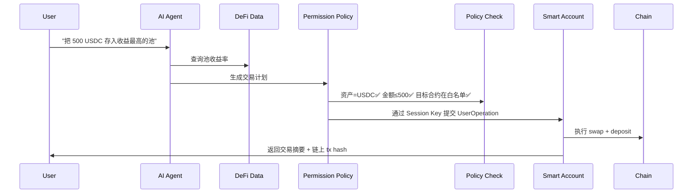

# Project Spec — AI-native Wallet v0.1

> Created: 2026-06-10 | Status: Draft

## 1. 用户画像

### Persona A: DeFi 新手 — 小陈
- 有 ETH/USDC，想参与 DeFi 但看不懂 AMM、滑点、gas
- 恐惧：点错按钮丢钱、不知道授权了什么
- 需求："帮我把 500 USDC 存到最安全的生息池，收益 > 3%"

### Persona B: 重度 DeFi 用户 — Alex
- 管多个钱包，需要定时调仓、止盈止损
- 痛点：盯盘累、手动操作慢、跨链管理复杂
- 需求："ETH 跌破 3000 时把 20% 仓位换成 USDC，同时通知我"

## 2. 痛点分析

| 痛点 | 现状 | AI 改进 | Web3 保证 |
|------|------|---------|-----------|
| 意图→执行断层 | 用户必须理解每个步骤 | AI 把意图翻译成交易计划 | Smart Account 校验边界 |
| 授权不透明 | 用户看不懂 calldata | AI 用自然语言解释交易 | 链上日志可审计 |
| 操作慢 | 手动点钱包确认 | Agent 在边界内自动执行 | Session Key 限制范围 |
| 权限失控 | 无限授权 | 时间/金额/合约三维约束 | On-chain 强制撤销 |

## 3. 核心流程



## 4. Permission Policy 规范

```python
# 初版权限策略数据模型
@dataclass
class PermissionPolicy:
    asset_whitelist: list[str]       # ["USDC", "ETH"]
    max_per_tx: float                 # 单笔上限
    max_per_day: float                # 每日上限
    allowed_contracts: list[str]      # 白名单合约地址
    allowed_functions: list[str]      # 白名单函数签名
    max_slippage_bps: int            # 最大滑点 (basis points)
    valid_until: int                  # 权限过期时间戳
    require_confirmation_above: float # 超过此金额需二次确认

@dataclass
class SessionKey:
    key_id: str
    policy: PermissionPolicy
    created_at: int
    last_used: int
    status: Literal["active", "revoked", "expired"]
```

## 5. 技术选型

| 层 | 技术 | 原因 |
|----|------|------|
| AI Agent | Python + LangChain/LlamaIndex | 已有经验 |
| 链上交互 | web3.py + eth-account | 成熟、文档好 |
| Smart Account | ERC-4337 (Safe{Wallet}) | 多签支持、模块化 |
| Session Key | Safe Modules / Biconomy | 内置权限模块 |
| RPC | llamarpc (public) | 免费、可靠 |
| 前端 | React + viem/wagmi | 标准 Web3 前端栈 |

## 6. 两周 Milestone

### Week 1: 权限基础设施
- [ ] Day 1-2: PermissionPolicy 数据模型完整实现 + 单元测试
- [ ] Day 3-4: Smart Account 部署 (ERC-4337) + Session Key 创建流程
- [ ] Day 5: 连接 RPC + 第一次通过 Smart Account 发交易
- [ ] Day 6-7: Permission Policy 校验层 + 边界测试

### Week 2: 端到端 Demo
- [ ] Day 8-9: AI intent parser（自然语言 → 交易计划）
- [ ] Day 10-11: 端到端集成：Intent → Policy Check → Smart Account → Tx
- [ ] Day 12-13: Demo UI (CLI 或 简单 Web)
- [ ] Day 14: Polish + Hackathon 提交材料